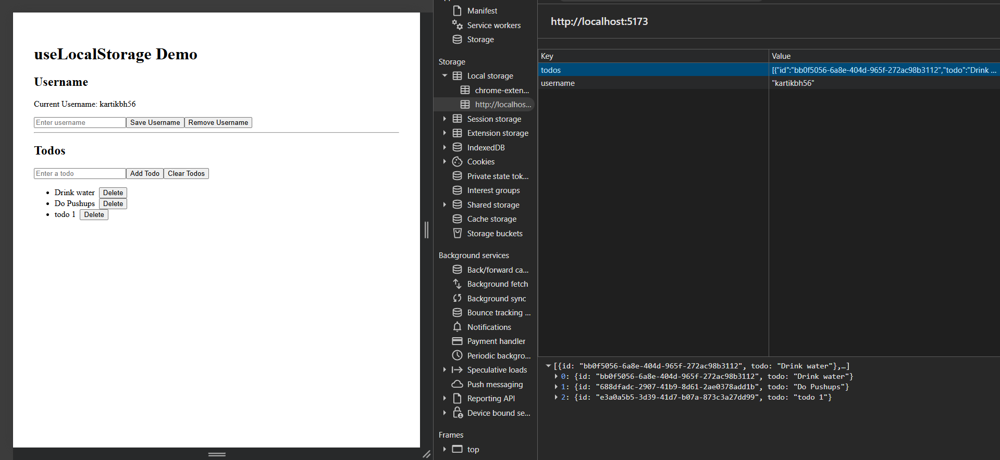
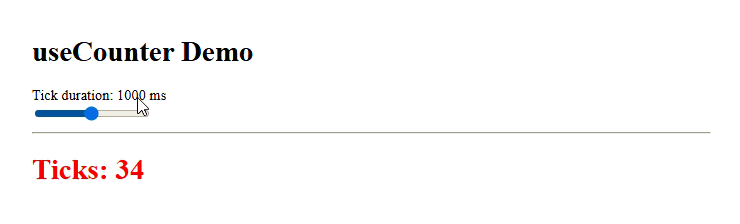

## `useLocalStorage` Demo



```typescript
// localStorage -> key:username, initialValue: "kartikbh56" (string)
const [username, setUsername, removeUsername] = useLocalStorage<string>(
  "username", // key
  "kartikbh56" // initial value
);

// localStorage -> key:todos, initialValue: Todos[] (object)
const [todos, setTodos, removeTodos] = useLocalStorage<Todo[]>(
  "todos", // key
  initialTodos // initial value
);
```

## `useCounter` Demo



````typescript
const [delay, setDelay] = useState(1000);
const count = useCounter(delay);
````

````typescript
export function useCounter(delay: number) {
  const [count, setCount] = useState(0);
  useEffect(() => {
    const id = setInterval(() => {
      setCount((c) => c + 1);
    }, delay);
    return () => clearInterval(id);
  }, [delay]);
  return count;
}
````
